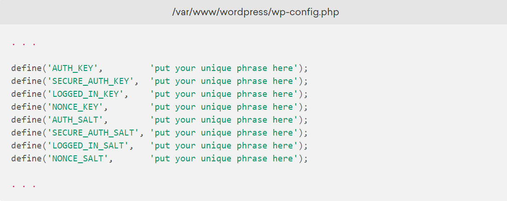

# <h1 align="center"> Infraestrutura para Sistemas Web <h1>
## <h2 align="center">Projeto em Infraestrutura 1 - CMS <h2>
  
  

  
  
Esse projeto consiste na instalação de um: Content Management System, ou Sistema de Gestão de Conteúdos. Existem vários sistemas de CMS no mercado. Abordaremos o Wordpress.
   
  
Requisitos:

  
  1. Você deverá instalar e configurar o Wordpress em sua infraestrutura; 
  2. Além da instalação e configuração, você deverá redigir um relatório descrevendo o processo;
  3. O relatório deverá ser escrito em Markdown e postado no seu GitHub, 
   a entrega consistem em mostrar o funcionamento do CMS e postar o link do relatório.
 
 
  
 
 ## 1. __Instalação do Wordpress no Ubuntu.__<h2>
  <h4>Pré-requisitos: </h4>
  
 Para seguir este tutorial, será necessário ter acesso a um servidor Ubuntu 18.04 e realizar as seguintes tarefas antes de iniciar este guia: 

  
  * __Criar um usuário sudo no seu servidor__: vamos realizar os passos neste guia usando um usuário não raiz com privilégios sudo. É possível criar um usuário com privilégios sudo seguindo nosso Guia de configuração inicial do servidor Ubuntu 18.04.
* __Instalar uma pilha LAMP:__ o WordPress precisará de um servidor Web, um banco de dados e um PHP para funcionar corretamente. Configurar uma pilha LAMP (Linux, Apache, MySQL, e PHP) cumpre todos esses requisitos. Siga este guia para instalar e configurar este software.
* __Proteger o seu site com o protocolo SSL:__ o Wordpress fornece conteúdo dinâmico e cuida da autenticação e autorização do usuário. O protocolo TLS/SSL é a tecnologia que permite criptografar o tráfego do seu site para que sua conexão esteja segura. A maneira como você irá configurar o SSL dependerá de se você tem um nome de domínio para seu site.
 

### 1.1. Criando um banco de dados do MySQL para o WordPress.  <h3>

  
 O primeiro passo que vamos dar é um passo preparatório. O WordPress utiliza o MySQL para gerenciar e armazenar as informações do site e as do usuário. Já temos o MySQL instalado, mas precisamos criar um banco de dados e um usuário para o WordPress usar. 

 Para começar, faça login na conta raiz (administrativa) do MySQL, inserindo este comando: 

~~~shell
mysql -u root -p
~~~

  
 Depois de executar o comando, será solicitada a senha que você configurou para a conta raiz do MySQL quando instalou o software. 

  
Primeiramente, criamos um banco de dados separado que o WordPress irá controlar. Você pode dar o nome que quiser ao banco de dados, mas neste tutorial nós o chamaremos de      wordpressdb para ficar mais simples. Crie o banco de dados para o WordPress digitando:

  
~~~mysql
CREATE DATABASE wordpressdb DEFAULT CHARACTER SET utf8 COLLATE utf8_unicode_ci;
~~~

>:information_source: __Nota:__ cada instrução do MySQL deve terminar em um ponto e vírgula (;). Verifique para garantir que a instrução foi seguida (ou seja, o ponto e vírgula foi usado), caso estiver enfrentando algum problema.

Em seguida, vamos criar uma conta de usuário do MySQL separada que vamos usar exclusivamente para operar no nosso novo banco de dados. Criar bancos de dados e contas para uma função é uma boa ideia sob o ponto de vista de gerenciamento e segurança. Vamos usar o nome <b>wordpressuser</b> neste guia. Sinta-se à vontade para alterar isso se quiser.

Vamos criar essa conta, definir uma senha e conceder o acesso ao banco de dados que criamos. Podemos fazer isso digitando o seguinte comando: Lembre-se de escolher uma senha forte para o usuário do seu banco de dados:

~~~mysql
CREATE USER 'wordpressuser'@'localhost' IDENTIFIED BY 'senha';
~~~

~~~mysql
GRANT ALL PRIVILEGES ON *.* TO 'wordpressuser'@'localhost' WITH GRANT OPTION;
~~~

Agora, você tem um banco de dados e uma conta de usuário, criados especificamente para o WordPress. Precisamos atualizar os privilégios para que a instância atual do MySQL saiba sobre as alterações recentes que fizemos, para isso use o comando:

~~~mysql
FLUSH PRIVILEGES;
~~~

Depois de fazer todas essas configurações, saia do MySql digitando o comando:

~~~mysql
EXIT;
~~~

### 1.2. Instalando extensões adicionais do PHP. <h3>

Ao configurar nossa pilha LAMP, precisamos apenas de um conjunto mínimo de extensões para fazer com que o PHP se comunique com o MySQL. O WordPress e muitos dos seus plug-ins potencializam extensões adicionais do PHP.

Podemos baixar e instalar algumas das extensões PHP mais populares para serem usadas com o WordPress digitando:

~~~shell
sudo apt update
sudo apt install php-curl php-gd php-mbstring php-xml php-xmlrpc php-soap php-intl php-zip
~~~

Depois de fazer esses comandos é preciso reiniciar o Apache para carregar essas novas extensões na próxima seção. Se estiver retornando aqui para instalar plug-ins adicionais, reinicie o Apache agora digitando:

~~~shell
sudo systemctl restart apache2
~~~

### 1.3. Ajustando a configuração do Apache para que o .htaccess considere as Substituições e Reescritas. <h3>
  
A seguir, vamos fazer alguns pequenos ajustes na nossa configuração do Apache. Baseado nos tutoriais de pré-requisitos, você deve ter um arquivo de configuração para seu site no diretório <b>/etc/apache2/sites-available/</b>. Vamos usar o <b>/etc/apache2/sites-available/wordpress.conf</b> como exemplo, mas você deve substituir o caminho com o seu arquivo de configuração, onde for apropriado.

  
Além disso, utilizaremos o <b>/var/www/wordpress</b> como o diretório raiz de nossa instalação do WordPress. Você deve usar a raiz da Web especificada em sua própria configuração.

  
  #### 1.3.1. Habilitando os arquivos de Substituição do .htaccess. <h4>

Atualmente, o uso dos arquivos do <b>.htaccess</b> está desabilitado. O WordPress e muitos plug-ins do WordPress usam esses arquivos de maneira intensa para fazer ajustes no diretório, de acordo com o comportamento do servidor Web.

Abra o arquivo de configuração Apache do seu site:

~~~shell
sudo nano /etc/apache2/sites-available/wordpress.conf
~~~

Para permitir os arquivos <b>.htaccess</b>, precisamos configurar a diretiva <b>AllowOverride</b> dentro de um bloco <b>Directory</b> apontando para nossa raiz de documentos. Adicione o seguinte bloco de texto dentro do bloco <b>VirtualHost</b> ao seu arquivo de configuração, certificando-se de usar o diretório raiz correto da Web:

~~~shell
<Directory /var/www/wordpress/>
    AllowOverride All
</Directory>
~~~

Quando terminar, salve e feche o arquivo.

#### 1.3.2. Habilitando o módulo Rewrite (Reescrita). <h4>

Em seguida, podemos habilitar o <b>mod_rewrite</b> para que possamos usar o recurso de permalink (ou link permanente) do WordPress:

~~~shell
sudo a2enmod rewrite
~~~

#### 1.3.3. Habilitando as alterações. <h4>

Antes de implementar as alterações que fizemos, verifique para garantir que não cometemos erros de sintaxe:

~~~shell
sudo apache2ctl configtest
~~~

O resultado pode ter uma mensagem que se pareça com essa:

~~~ASN.1
Output
AH00558: apache2: Could not reliably determine the server's fully qualified domain name, using 127.0.1.1. 
Set the 'ServerName' directive globally to suppress this message
Syntax OK
~~~

Se quiser suprimir a linha superior, basta adicionar uma diretiva de <b>ServerName</b> ao seu arquivo de configuração principal (global) do apache em Apache em <b>/etc/apache2/apache2.conf</b>. O <b>ServerName</b> pode ser o domínio ou endereço IP do seu servidor. Entretanto, esta é apenas uma mensagem e <b>não afeta o funcionamento do nosso site</b>. Contanto que a saída mostre <b>Syntax OK</b>, você estará pronto para continuar.

Reinicie o Apache para implementar as alterações:

~~~shell
sudo systemctl restart apache2
~~~

Depois de fazer todas essas configurações o próximo passo é baixar o Worpress.

### 1.4. Fazendo download do WordPress. <h3>

Agora que o software do nosso servidor está configurado, podemos baixar e configurar o WordPress. Por motivos de segurança, é sempre recomendável obter a versão mais recente do WordPress do site deles.

Altere para um diretório gravável e baixe o arquivo comprimido da versão digitando:

~~~shell
cd /tmp
curl -O https://wordpress.org/latest.tar.gz
~~~

Extraia o arquivo comprimido para criar a estrutura de diretórios do WordPress:

~~~shell
tar xzvf latest.tar.gz
~~~

Vamos mover esses arquivos temporariamente para nossa raiz de documentos. Antes de fazermos isso, adicionamos um arquivo de <b>.htaccess</b> fictício para que esteja disponível para o WordPress usar mais tarde.

Crie o arquivo digitando:

~~~shell
touch /tmp/wordpress/.htaccess
~~~

Também vamos copiar o exemplo de arquivo de configuração sobre o nome do arquivo, de modo que, na prática, o WordPress leia o seguinte:

~~~shell
cp /tmp/wordpress/wp-config-sample.php /tmp/wordpress/wp-config.php
~~~

Também podemos criar o diretório de <b>upgrade</b>, para que o WordPress não se depare com questões de permissão ao tentar fazer isso sozinho após uma atualização em seu software:

~~~shell
mkdir /tmp/wordpress/wp-content/upgrade
~~~

Agora, podemos copiar o conteúdo todo do diretório para nossa raiz de documentos. Estamos usando um ponto no final do nosso diretório fonte para indicar que tudo dentro do diretório deve ser copiado, incluindo arquivos ocultos (como o arquivo <b>.htaccess</b> que criamos):

~~~shell
sudo cp -a /tmp/wordpress/. /var/www/wordpress
~~~

### 1.5. Configurando o diretório WordPress. <h3>

Antes de fazermos a configuração do WordPress baseada na Web, precisamos ajustar alguns itens em nosso diretório do WordPress.

#### 1.5.1. Ajustando a Propriedade e as Permissões. <h4>

Uma das coisas mais importantes que precisamos fazer é configurar permissões razoáveis e a propriedade sobre os arquivos.

Vamos começar concedendo a propriedade de todos os arquivos para o usuário e grupo <b>www-data</b>. Este é o usuário sob o qual o webserver Apache executa. O Apache terá que ser capaz de ler e gravar arquivos do WordPress para atender o site e realizar atualizações automáticas.

Atualize a propriedade com o <b>chown</b>:

~~~shell
sudo chown -R www-data:www-data /var/www/wordpress
~~~

Em seguida, executaremos dois comandos <b>find</b> para definir as permissões corretas sobre os diretórios e arquivos do WordPress:

~~~shell
sudo find /var/www/wordpress/ -type d -exec chmod 750 {} \;
sudo find /var/www/wordpress/ -type f -exec chmod 640 {} \;
~~~

Essas devem ser permissões razoáveis para começar. Alguns plug-ins e procedimentos podem precisar de ajustes adicionais.

#### 1.5.2. Configurando o arquivo de configuração do WordPress <h4>

Agora, precisamos fazer algumas alterações no arquivo de configuração principal do WordPress.

Quando abrimos o arquivo,nossa prioridade será ajustar algumas chaves secretas para dar segurança para nossa instalação. O WordPress oferece um gerador seguro para esses valores para que você não tenha que tentar obter bons valores por conta própria. Esses valores são usados internamente, de modo que ter valores seguros e complexos aqui não irá atrapalhar a usabilidade.

Para pegar valores seguros do gerador de chave secreta do WordPress, digite:

~~~shell
curl -s https://api.wordpress.org/secret-key/1.1/salt/
~~~

Você receberá valores únicos que se parecem com estes:

>:warning:__Aviso!:__ É importante que você solicite sempre valores únicos. __NÃO__ copie os valores mostrados abaixo! 

~~~ASN.1
Outputs
define('AUTH_KEY','1jl/vqfs<XhdXoAPz9 c_j{iwqD^<+c9.k<J@4H');
define('SECURE_AUTH_KEY','E2N-h2]Dcvp+aS/p7X {Ka(f;rv?Pxf})CgLi-3');
define('LOGGED_IN_KEY','W(50,{W^,OPB%PB<JF 2;y&,2m%3]R6DUth[;88');
define('NONCE_KEY','ll,4UC)7ua+8<!4VM+ #`DXF+[$atzM7 o^-C7g');
define('AUTH_SALT','koMrurzOA+|L_lG}kf 07VC*Lj*lD&?3w!BT#-');
define('SECURE_AUTH_SALT','p32*p,]z%LZ+pAu:VY C-?y+K0DK_+F|0h{!_xY');
define('LOGGED_IN_SALT','i^/G2W7!-1H2OQ+t$3 t6**bRVFSD[Hi])-qS`|');
define('NONCE_SALT','Q6]U:K?j4L%Z]}h^q7 1% ^qUswWgn+6&xqHN&%');
~~~

Essas são linhas de configuração que podemos colar diretamente no nosso arquivo de configuração para definir chaves seguras. Copie o resultado que acabou de receber.

Agora abra o arquivo de configuração do WordPress:

~~~shell
sudo nano /var/www/wordpress/wp-config.php
~~~

Encontre a seção que contém os valores fictícios para essas configurações. Eles se parecerão com isso:

Exclua essas linhas e cole os valores que copiou da linha de comando:

Em seguida, precisamos modificar algumas das configurações de conexão do banco de dados no início do arquivo. Você precisa ajustar o nome do banco de dados, o usuário do banco de dados e a senha associada que configuramos no MySQL.

A outra mudança que precisamos fazer é definir o método que o WordPress deve usar para gravar no sistema de arquivos. Uma vez que demos permissão ao servidor Web para gravar onde ele precisar, podemos definir explicitamente o método do sistema de arquivos como “direct” (direto). Deixar de definir esse método de acesso - usando nossas configurações atuais, levaria o WordPress a solicitar credenciais FTP quando realizássemos algumas ações.

Esta configuração pode ser adicionada abaixo das configurações de conexão do banco de dados ou em qualquer outro lugar no arquivo:

Depois de fazer essas alterações no arquivo wp-config.php, salve e feche o arquivo.

### 1.6. Concluindo a instalação através da Interface com a Web. <h3>

Agora que a configuração do servidor está completa, podemos concluir a instalação através da interface com a Web.

No seu navegador Web, navegue até o nome de domínio do seu servidor ou endereço IP público:

~~~apl
https://server_domain_or_IP/wordpress
~~~

Selecione a linguagem que você gostaria de usar:

Em seguida, você chegará à página de configuração principal.

Selecione um nome para seu site do WordPress e escolha um nome de usuário <b>(É recomendável não escolher algo como “admin” por motivos de segurança)</b>. Uma senha forte será gerada automaticamente. Salve essa senha ou selecione uma senha forte alternativa.

Digite seu endereço de e-mail e selecione se deseja impedir que mecanismos de pesquisa façam a indexação do seu site:

 

Quando clicar adiante, você será levado para uma página que solicita que você faça login:

Assim que fizer login, será levado para o painel de administração do WordPress:

### 1.7. Conclusão <h3>

O Wordpress deve estar instalado e pronto para usar! Alguns dos passos comuns na sequência serão: escolher a configuração dos permalinks dos seus posts (pode ser encontrado em <b>Configurações > Permalinks</b>) ou selecionar um novo tema (em <b>Appearance > Themes</b>). Se esta é a primeira vez que usa o WordPress, explore a interface um pouco para se familiarizar com o seu novo CMS.

### 1.8. Referências <h3>

[Como instalar o WordPress com o LAMP no Ubuntu 18.04](https://blog.da2k.com.br)

